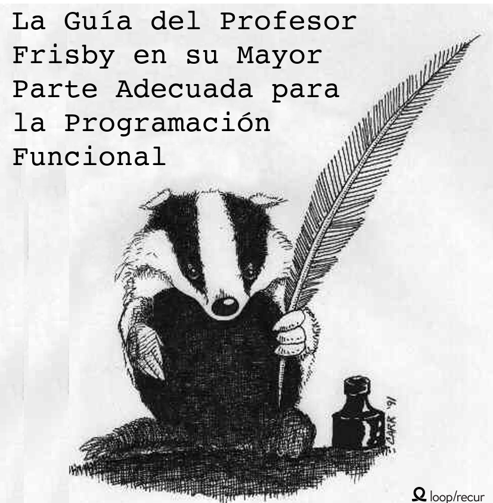

[](SUMMARY-es.md)

## Sobre el libro

Este libro trata sobre el paradigma funcional en general.Utilizaremos el lenguaje de programación funcional más popular: Javascript. Quizás algunos creen que esta es una pobre elección ya que va en contra de la cultura actual, la cual por el momento, siente ser predominantemente imperativa. De todas formas, creo esta es la mejor forma de aprender PF por diversas razones:

 * **Seguramente lo utilizes cada día en el trabajo.**

    Esto hace posible el prácticar y aplicar cada día los conocimientos adquiridos en programas del mundo real en vez de proyectos de una sola noche o de un fin de semana con un lenguaje PF esotérico.

 * **No tenemos que aprender todo desde cero para empezar a programar aplicaciones**

    En un lenguaje funcional puro, no puedes registrar una variable o leer un nodo DOM sin usar monads. Aquí podemos hacer un poco de trampa mientras vayamos aprendiendo como purificar nuestro codebase. También es más fácil, empezar con este lenguaje ya que es un paradigma mixto y te puedes apoyar con lo que ya conoces mientras vas aprendiendo.


 * **El lenguaje esta completamente capacitado para escribir código funcional de primera categoria.**

    Tiene todas las características que se necesitan para imitar un lenguaje como Scala o Haskey con la ayuda de una o dos pequeñas librerías. Programación orientada a objetos domina actualmente la industria, pero es claramente incómodo en JavaScript. Esto es parecido a acampar fuera en una carretera o bailar claqué con botas de agua. Tenemos que hacer `bind` en todos los lados para que `this` no cambie sin nosotros saberlo, no tenemos clases [^Aún], tenemos varias soluciones para arreglar el extraño comportamiento cuando te olvidas de llamar `new` , miembros privados solo estan disponibles miediante closures. Para muchos de nosotros, PF parace mas natural de todos modos.

Dicho esto, lenguajes funcionales con tipado serán, sin duda alguna, el mejor lugar para programar con el estilo que se presenta en este libro. JavaScript será nuesto medio para aprender un paradigma. Donde lo apliques depende de tí. Afortunadamente, las interfaces son matemáticas y, como tal, ubicuas. Te encontrarás como en casa con swiftz, scalaz, haskell, purescript, y otros sistemas matemáticos.


### Gitbook (para una mejor experiencia)

* [Leelo online](http://drboolean.gitbooks.io/mostly-adequate-guide/)
* [Descarga EPUB](https://www.gitbook.com/download/epub/book/drboolean/mostly-adequate-guide)
* [Descarga Mobi (Kindle)](https://www.gitbook.com/download/mobi/book/drboolean/mostly-adequate-guide)

### Hazlo tú mismo

```
git clone https://github.com/DrBoolean/mostly-adequate-guide.git

cd mostly-adequate-guide/
npm install gitbook-cli -g
gitbook init

brew update
brew cask install calibre

gitbook mobi . ./functional.mobi
```


# Contenido

See [SUMMARY.md](SUMMARY-es.md)

### Contribuir

See [CONTRIBUTING.md](CONTRIBUTING-es.md)

### Traducciones

See [TRANSLATIONS.md](TRANSLATIONS-es.md)


# Planes para el futuro

* **Parte 1** es una guia básica. La actualizaré a medida que encuentre errores ya que esto es inicialmente un borrador. Toda ayuda es bienvenida!
* **Parte 2** se dedicará a clases como functors y monads hasta transitable. Espero mostrar también transformaciones y aplicaciones puras.
* **Parte 3** cruzará la delgada línea entre la programación práctica y la absurdidad académica. Hecharemos un vistazo a comonads, f-algebras, monads libres, yoneda, y otras construcciones categóricas.
